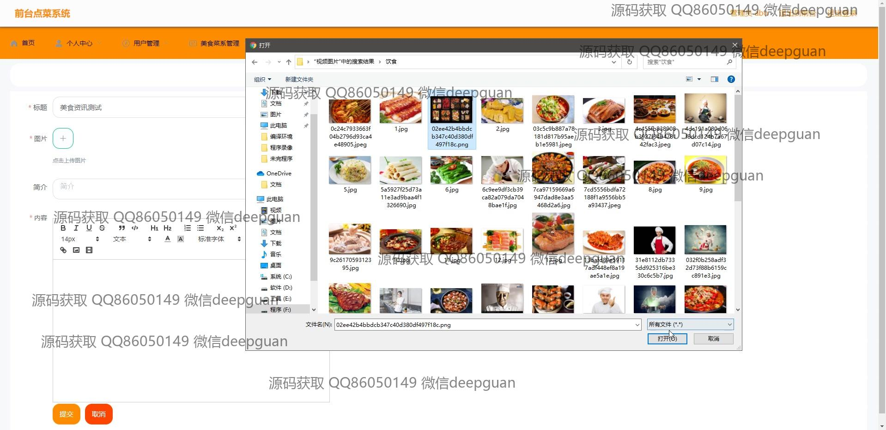
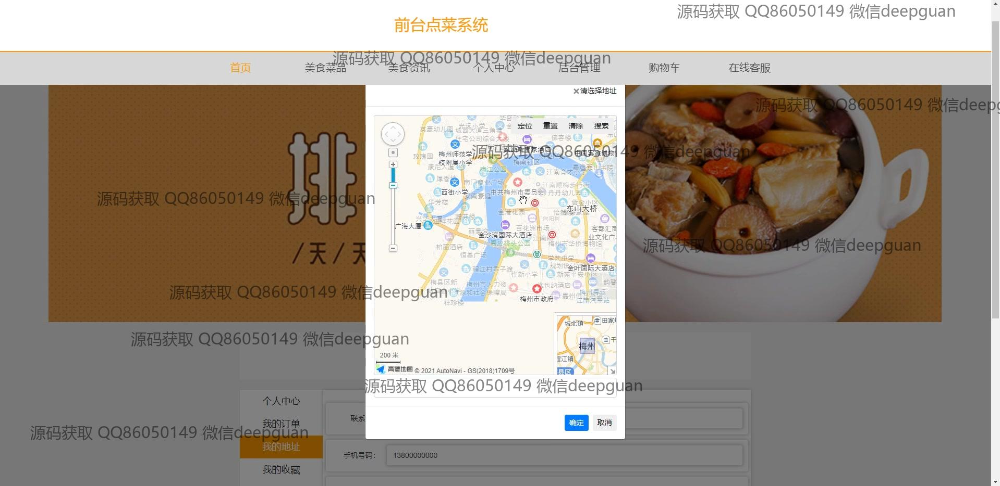
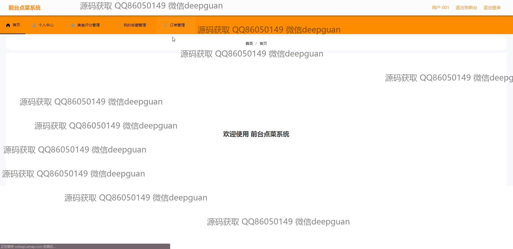

<h1 align="center">的vue前台美食点菜订餐系统vue</h1>

## 简介
美食点菜订餐系统：角色分为管理员、用户；功能包括美食信息录入与编辑、个人信息管理、菜品图片上传、订单管理、用户注册与登录、地址管理和在线客服互动。    --计算机毕业设计源码；毕设源码；java毕业设计源码

## 联系方式

<h3 align="center">获取完整代码与数据库文件 + 微信：deepguan QQ: 86050149 QQ群: 783742310</h3>

<h3 align="center">可帮忙远程部署 包运行成功！提供远程部署、修改代码、设计文档指导、代码讲解等服务！</h3>

## 功能介绍（完整见运行截图）
管理员：登录、注册、退出；导航管理包括用户管理、菜品管理、系统管理等模块；支持菜品信息的录入、编辑和图片上传，管理库存、价格及食材信息；提供后台美食菜谱的分类和详情编辑功能；订单管理模块支持订单查看与状态更新；可管理用户评论和评分内容，确保平台内容质量。

用户：支持登录、注册、退出功能；首页包含美食菜品推荐、搜索框及导航菜单，可快速浏览和选择菜品；支持菜品的点赞、收藏、添加购物车及立即购买操作；个人中心模块提供信息管理、密码修改、订单查看及地址管理功能；可上传头像、评论菜品，并与在线客服互动。

## 运行截图

本代码来源于网络,仅供学习参考使用!

